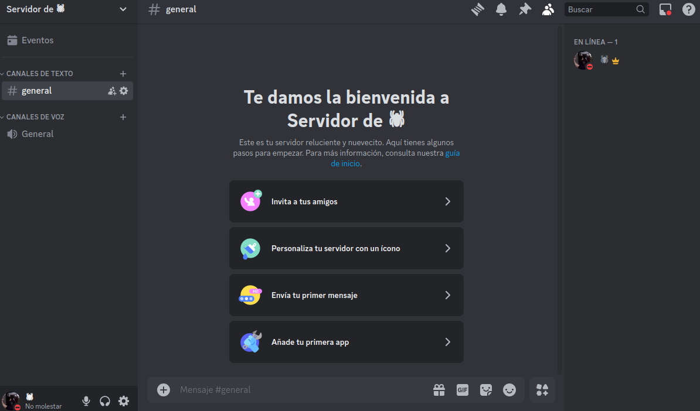

# Guia de instalacion de discord
**En esta guia te mostrare como instalaremos y crearemos un servidor en discord**
##  Paso 1: Instalacion de discord
**En mi caso yo tengo Ubuntu, asi que no necesito descargarlo desde la terminal de codigo**

en el caso de que no tengas deberias de descargar discord desde su pagina oficial

al ya tener el discord descargado debes hacer este comando

ls

cd ./Descargas/

sudo dpkg -i discord-0.0.76.deb

## Paso 2: creacion de un servidor

cuando hayas terminado de crearte una cuenta e iniciado sesion lo que deberias hacer es crear un servidor

desde aqui eliges que tipo de servidor quieres crear, si tu propio modelo o empezar desde una plantilla

## Paso 3: Personalizacion del servidor
una vez creado este servidor al entrar te aparecera asi.

te apareceran los canales de texto, un mensaje de bienvenida y las personas en linea

ya que estamos aca vamos a personalizar los canales de voz y texto como queramos. Para personalizarlos lo unico que deberiamos hacer es usar el mouse y el teclado en la parte izquierda en donde aparecen los canales de voz y texto.

este es un ejemplo de como to personalize los canales de texto y voz en mi servidor

Para seguir con el servidor, anadiremos algunos bots, estos sirven para mejorar el rendimiento de las personas adentro del server.

estos son los bots que yo agregue a mi servidor

Para agregar a los bots tienen que entrar en la parte de arriba a la izquierda en donde dice el nombre de su servidor y tocar en **directorio de apps**

Ya cuando enten alli les va a salir un directorio en donde van a encontraran muchismos bots. Ustedes eligan el que quieran

Para seguir vamos a agregar roles, los roles sirven para que los administradores tengan mas control que los usuarios. La pestana de roles esta en los ajustes generales del servidor, que se entra desde el mismo lugar que las apps.

Cuando entres en los ajustes en el sugundo lugar de los ajustes van a estar los roles, solamente tienen que meterse y clickear en donde dice "crear rol"

.
ya al estar en la creacion de roles le pueden cambiar el nombre, el color, los permisos, si pueden adjuntar enlaces y si pueden gestionar miembros. Otras cosas que se pueden cambiar son las imagenes que estan al lado del nombre cuando tienen el rango pero eso se puede usar solo con discord **NITRO**

Estos son los roles que yo agregue a mi servidor. Para anadirle a un miembro un rol lo unico que deberias hacer es tocar su nombre, anadir rol, y agregarle el que quieras.

Para seguir, te voy a ensenar a cambiarle el nombre y la imagen a tu servidor

En los ajustes del servidor vas a poder cambiarle la imagen y el nombre a tu servidor de discord.

## Paso 4: Invitar a amigos y ponerse a hablar

Ahora para invitar a amigos lo que vamos a hacer es mandarles el enlace de invitacion. Este enlace se puede compartir en la parte de donde se entra a los ajustes del servidor

Si queres invitar a un amigo por discord solo le das a **invitar**
o sino podes copiar el enlace que caduca en 7 dias, osea, que si no lo abre en 7 dias despues no se puede unir.

Y asi es como creas un servidor en discord para vos y tus amigos, pero si queres crear uno para una comunidad es minimo 10 veces mas complejo

### Saludos y gracias